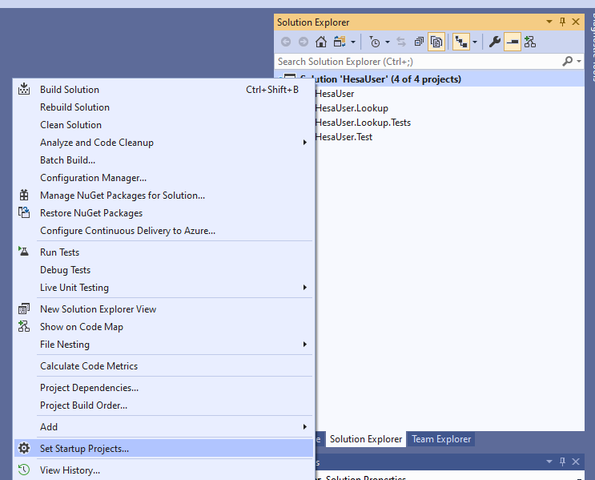
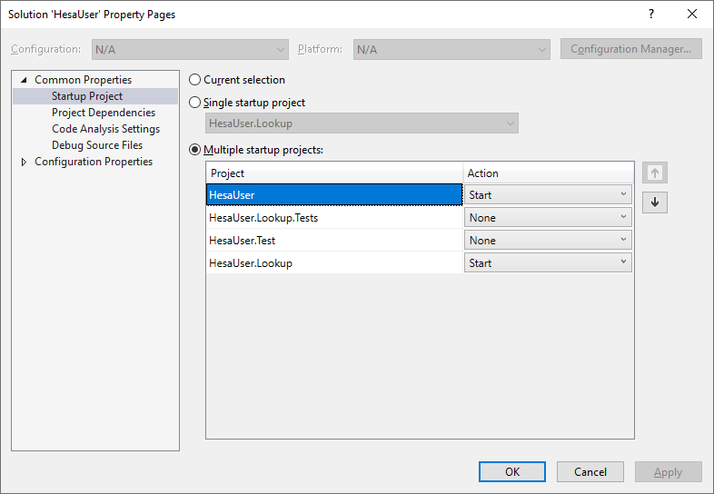
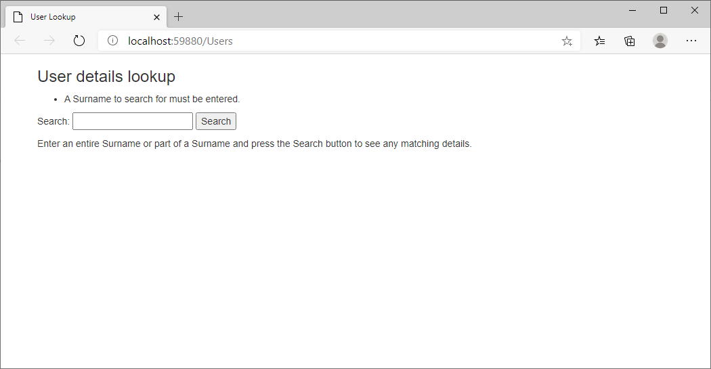
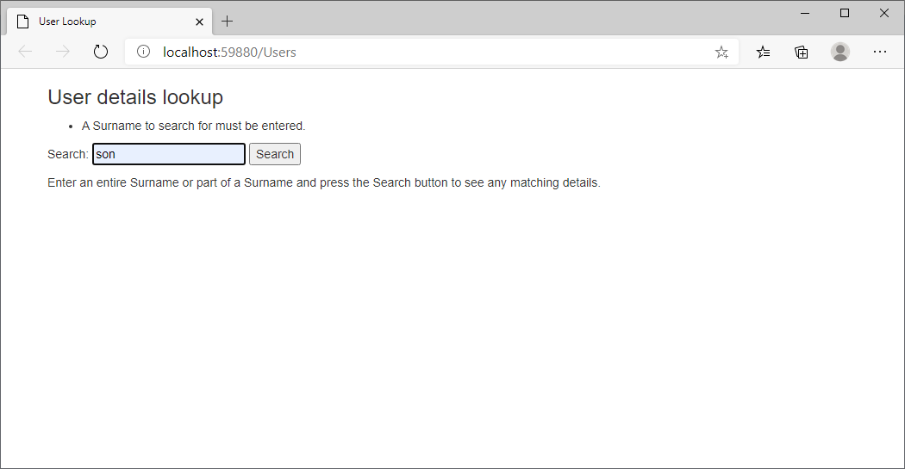
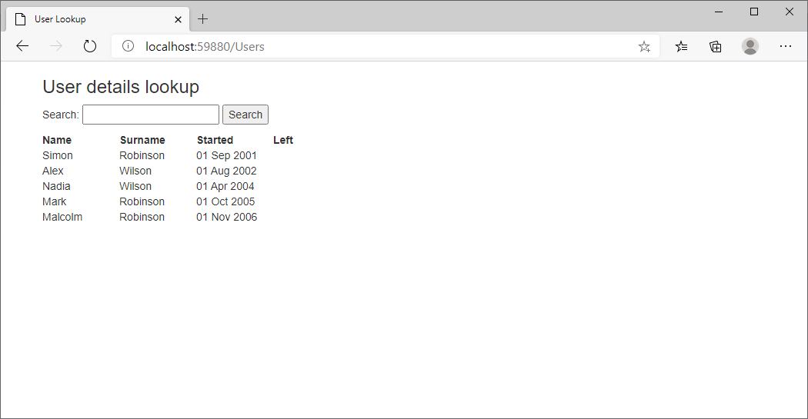
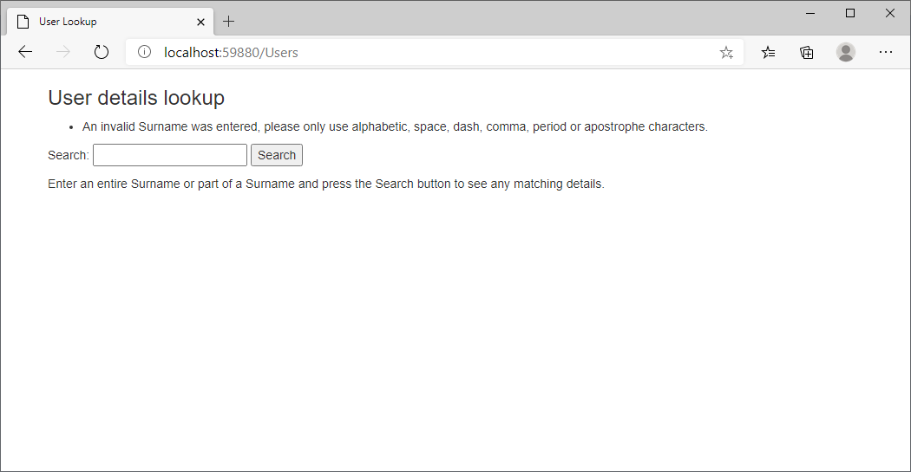
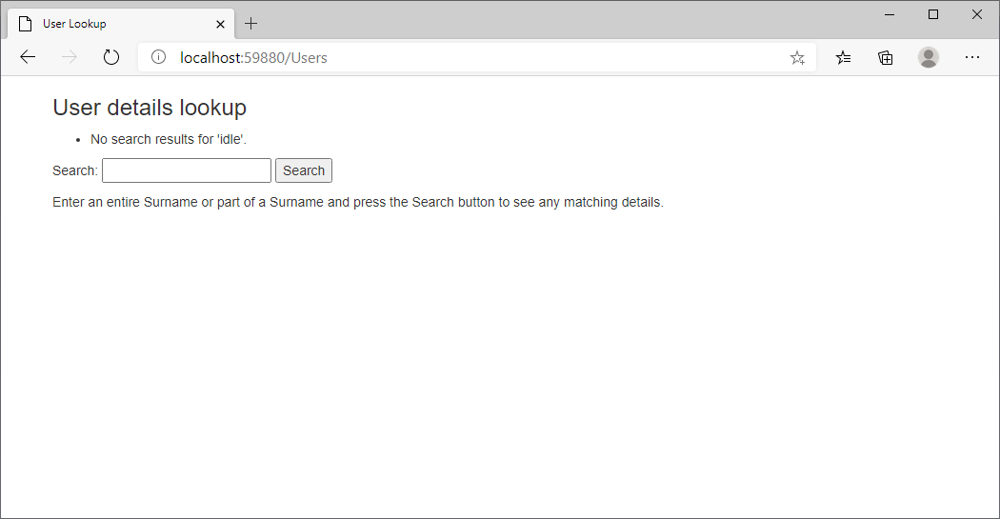

# Description
This is a VisualStudio 2019 Solution with four projects:
1. A Web API offering a Surname search endpoint on DB persisted data.
2. Some tests against the WEB API
3. An MVC front end using the above Web API offering a Surname search UI to get and display associated user details.
4. The skeleton of tests for the UI based on SpecFlow but not fully implemented as it would require Selenium Web Drivers to be installed to complete and this is beyond the scope of the test.

## Web API
Entity Framework is layered on Sqlite to query and persist a List of User objects where each User object will notionally hold first name, surname, employment start date and leave date, these will be our example details.  
For testing the Web API an in memory database is used to provide a specific set of details to count results for known surnames.  
One GET endpoint is provided api/Users/Filter which for a request receives a Surname filter string i.e. find surnames containing the given filter text. The response is a Json array of the above user details associaed with the given request surname or an empty list if no matching surnames are found.

## Front End
This is an MVC .Net Core site with a single screen allowing part of a surname to be entered to search for associated user detail.  
The text input is validated within the Controller GET method to only accept valid surname characters; this is generally useful but also aimed at preventing any malicious script being entered.  
A SpecFlow test framework exists based on the feature like description in the test question but is currently not implemented but the potential exists to integrate Selenium tests to drive a browser and check UI results.

## Installation
It is expected to run this Solution under Visual Studio 2019 and you **will need** to configure multiple startup projects to run the Solution as the multiple startup settings used to run this project are not saved in the solution by Visual Studio.  
The actual requirement is to run HesaUser first (the Web API) then HesaUser.Lookup (the Search page UI) and this is described next.
### Configuring the multiple startup projects
1. Under Solution Explorer right-click the Solution then select `Set Startup Projects...`
  

2. The HesaUser project which is the Web API search provider should be the first project to run i.e. at the top of the list. If this is not the case select it then click the Up Arrow button until it is at the top of the list.
  

3. Now your Visual Studio Start menu should look like below:
  

## Usage
Now starting the solution as usual by either pressing F5 or clicking the green arrow Start button you should be presented with the search page.
  

The search matches Surnames held in the database that contain the entered search for text. If we enter 'son' we should see results for Robinson and Wilson both of which contain 'son'. Searches are case-sensitive, this is due to the default collation setttings of the underlying database.
  

After pressing the Search button the following results should be seen.
  

The search results show example user detail, first name, start date and leaving date. Only one sample entry has a leaving date for the user with the surname 'Jones'. If we search for Jones we see the detail column with the heading 'Left' populated with a date which is otherwise blank.
  
![Seach result detail for 'Jones' showing a leaving date](images/SearchResultsForJones.png]
A filter is applied to only allow valid surnames to be searched for. The search filter does not allow numeric characters so if we try searching using 'son4' a search error response is shown.
  

If we search for a surname that doesn't exist in the database e.g. 'Idle' we see a no search results message.
  

